# AI-Virtual-Idol

> MediaPipe 기반 실시간 모션 추적과 Azure AI를 결합하여 사용자와 상호작용 가능한 AI 버추얼 캐릭터 플랫폼

## 🎬 Demo

\-▶ Demo Video)(https://youtu.be/N3hU5rFb31I?si=Ayiu-H0NHnc_HXUg)

## 목차

- 프로젝트 소개
- 프로젝트 개요
- 시스템 아키텍처
- 기술 스택
- 주요 기능
  - 실시간 모션 추적 및 아바타 모션 매핑(Avatar Motion Mapping)
  - AI 음성 대화(STT/TTS)
  - Azure OpenAI 기반 AI 캐릭터
  - YouTube Live Chat 연동
  - 버추얼 캐릭터 생성 및 적용
- 기술적 문제 해결
  - MediaPipe Landmark를 Unity Humanoid Bone으로 모션 매핑(Motion Mapping)
  - BlendShape를 이용한 표정 구현
  - Azure AI 서비스 통합
- 프로젝트를 통해 배운 점
- 아쉬웠던 점
- 앞으로 개선하고 싶은 점

---

## 프로젝트 소개

(작성 예정)

---

## 프로젝트 개요

| 항목 | 내용 |
|------|------|
| 프로젝트명 | eruzA |
| 프로젝트 형태 | Microsoft AI School 팀 프로젝트 |
| 개발 기간 | 2024.09.26 ~ 2024.10.29 |
| 개발 인원 | 6명 |
| 역할 | Unity Window Application / MediaPipe / Motion Mapping / YouTube Live Chat / Azure AI Integration |

### 담당 역할

- Unity Window Application 구현
- MediaPipe 기반 실시간 모션 추적
- Unity Avatar Motion Mapping
- Azure Speech(STT/TTS) 연동
- Azure OpenAI 연동
- YouTube Live Chat 연동
- 프로젝트 기능 통합

---

## 시스템 아키텍처
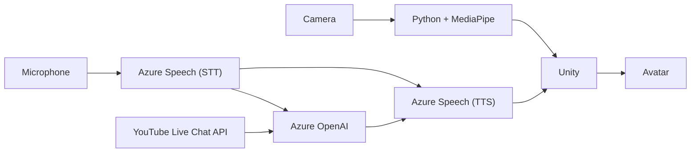
AI-Virtual-Idol은 MediaPipe 기반 실시간 모션 추적, Azure AI 음성 처리, YouTube Live Chat 연동을 하나의 Unity 애플리케이션으로 통합하여 구성했습니다.

---

## 기술 스택

| Category | Technologies |
|----------|--------------|
| **Engine** | Unity |
| **Language** | C#, Python |
| **AI** | Azure OpenAI, Azure Speech(STT/TTS) |
| **Computer Vision** | MediaPipe |
| **API** | YouTube Live Chat API |
| **Tool** | VRoid Studio, Blender |
| **Version Control** | Git, GitHub |

MediaPipe를 이용한 실시간 모션 추적과 모션 매핑(Motion Mapping)을 중심으로, Azure AI(STT/TTS, OpenAI)와 YouTube Live Chat API를 연동하여 사용자와 상호작용 가능한 AI 버추얼 캐릭터 플랫폼을 구현했습니다.

---

## 주요 기능

### 1. 버추얼 캐릭터 커스터마이징

팀에서 **VRoid Studio**를 통해 제작한 캐릭터를 기반으로, 사용자는 원하는 캐릭터를 선택한 뒤 **Azure Speech**를 통해 생성한 음성과 **Character Prompt**를 설정하여 자신만의 버추얼 캐릭터를 구성할 수 있습니다.

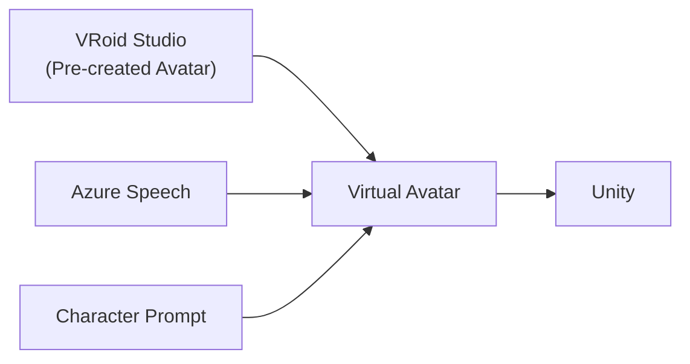

  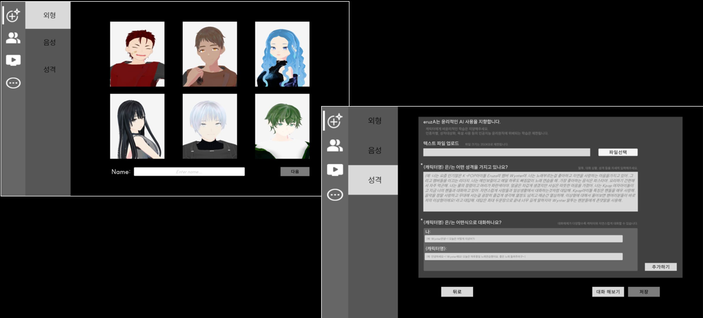

  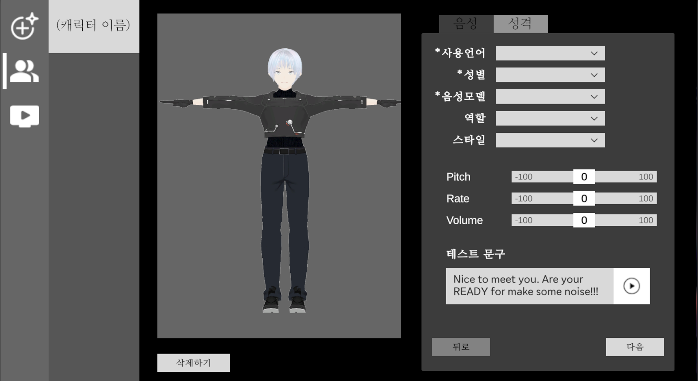

### 2. 실시간 모션 추적 및 모션 매핑(Motion Mapping)

MediaPipe를 활용하여 사용자의 전신, 손, 얼굴 랜드마크를 실시간으로 추출하고, Python에서 처리한 모션 데이터를 UDP 통신을 통해 Unity로 전달하여 Virtual Avatar에 적용합니다.

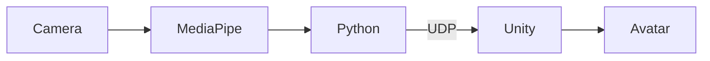

  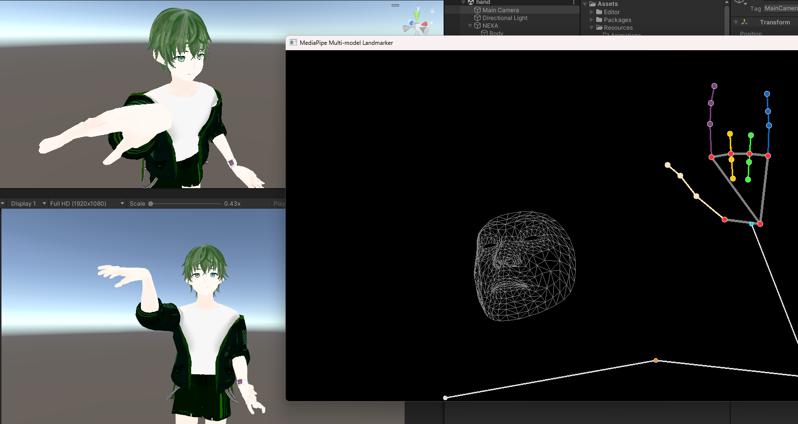

### 3. AI Character Mode

사용자는 텍스트 또는 음성을 통해 AI 캐릭터와 대화할 수 있습니다. 음성 입력은 **Azure Speech(STT)**를 통해 텍스트로 변환되며, **Azure OpenAI**가 설정된 Character Prompt를 기반으로 캐릭터의 성격을 반영한 응답을 생성합니다. 생성된 응답은 채팅으로 출력되는 동시에 **Azure Speech(TTS)**를 통해 캐릭터의 음성으로도 제공됩니다.

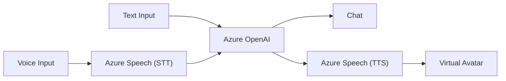

  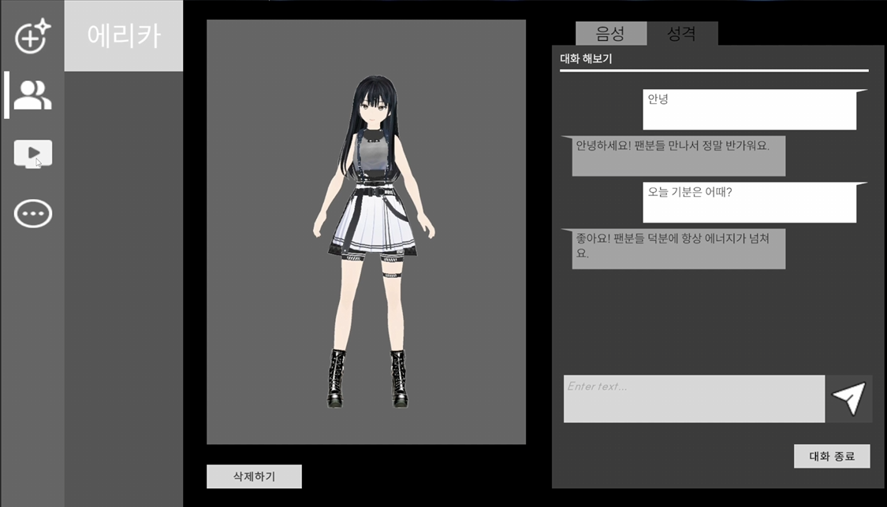

### 4. Virtual Idol Mode

MediaPipe 기반 모션 매핑(Motion Mapping)을 통해 사용자의 전신, 손, 얼굴 움직임을 실시간으로 Virtual Avatar에 반영하여 실제 버추얼 아이돌처럼 자연스러운 방송을 진행할 수 있습니다. 또한 YouTube Live Chat과 연동하여 시청자의 채팅에 AI가 Character Prompt를 기반으로 응답하고, 생성된 응답을 캐릭터의 음성과 채팅으로 출력하여 실시간 상호작용을 제공합니다.

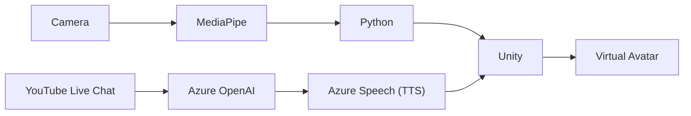

  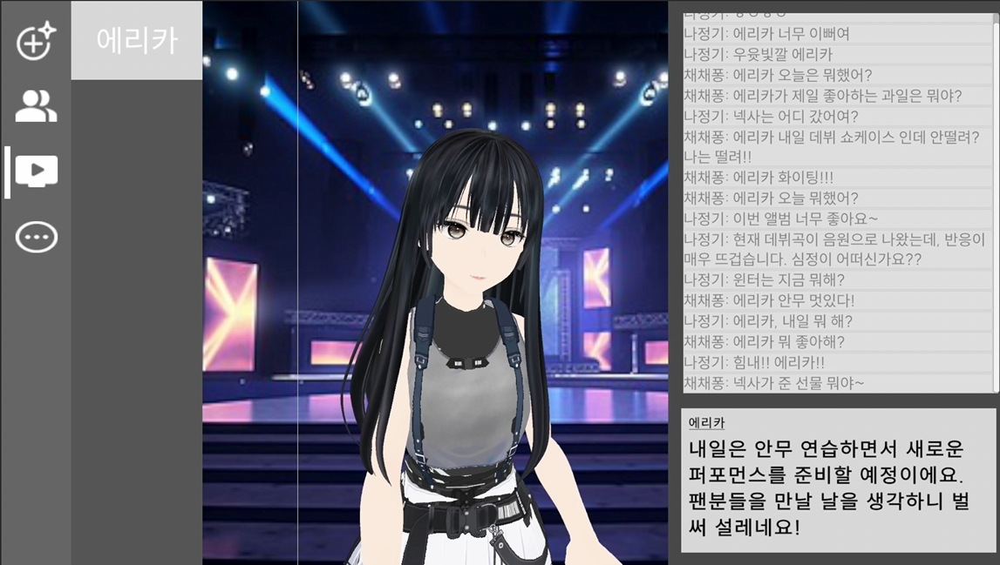

---

## 기술적 문제 해결

### 1. MediaPipe 랜드마크를 Unity Avatar Motion으로 변환

#### 문제

MediaPipe는 **Pose, Hands, Face** 랜드마크를 각각 독립적으로 제공하지만, Unity Avatar는 **Bone**과 **Blend Shape** 기반으로 동작하기 때문에 데이터를 그대로 적용할 수 없었습니다.

또한 MediaPipe와 Unity의 좌표계 차이로 인해 Avatar가 실제 움직임과 반대로 동작하거나, 손목 회전 및 일부 관절에서 잔떨림과 부자연스러운 움직임이 발생하는 문제가 있었습니다.

#### 해결

Pose, Hands, Face 데이터를 각각 독립적으로 처리하고 별도의 UDP 포트를 통해 Unity로 전달하여 Avatar의 각 구성 요소를 개별적으로 제어했습니다.

손목 회전은 손목, 검지, 중지 랜드마크를 이용하여 법선 벡터를 계산하고 `Quaternion.LookRotation()`을 통해 Bone Rotation으로 변환했습니다. 얼굴 표정은 MediaPipe가 제공하는 Blend Shape 값을 Unity의 **Skinned Mesh Renderer**와 매핑하여 Avatar의 표정에 적용했습니다.

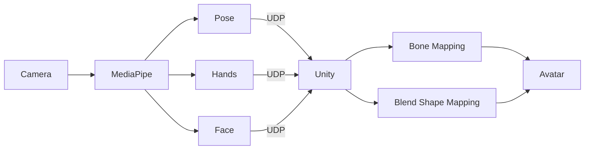

    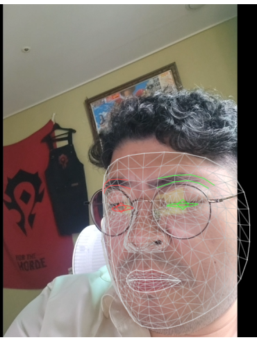
    &nbsp;
    

#### 결과

MediaPipe의 랜드마크를 Unity Avatar Motion으로 변환하여 실시간 모션 매핑과 얼굴 표정 표현을 구현했습니다.

다만 좌표계 차이와 Landmark 기반 추정의 한계로 인해 일부 관절에서 잔떨림과 방향 불일치가 발생했습니다. IK 적용과 회전 보정 등 다양한 방법으로 개선을 시도했지만 상용 서비스 수준의 자연스러운 Motion Quality에는 도달하지 못했으며, 이를 통해 실시간 Motion Mapping에서 좌표계와 Bone 구조를 함께 고려한 보정의 중요성을 확인할 수 있었습니다.

---

## 프로젝트를 통해 배운 점

(작성 예정)

---

## 아쉬웠던 점

(작성 예정)

---

## 앞으로 개선하고 싶은 점

(작성 예정)
