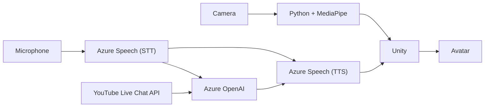

# AI-Virtual-Idol

> MediaPipe 기반 실시간 모션 추적과 Azure AI를 결합하여 사용자와 상호작용 가능한 AI 버추얼 캐릭터 플랫폼

## 🎬 Demo

\-▶ Demo Video)(https://youtu.be/N3hU5rFb31I?si=Ayiu-H0NHnc_HXUg)

## 목차

- 프로젝트 소개
- 프로젝트 개요
- 시스템 아키텍처
- 기술 스택
- 주요 기능
  - 실시간 모션 추적 및 Avatar Motion Mapping
  - AI 음성 대화(STT/TTS)
  - Azure OpenAI 기반 AI 캐릭터
  - YouTube Live Chat 연동
  - 버추얼 캐릭터 생성 및 적용
- 기술적 문제 해결
  - MediaPipe Landmark를 Unity Humanoid Bone으로 Motion Mapping
  - BlendShape를 이용한 표정 구현
  - Azure AI 서비스 통합
- 프로젝트를 통해 배운 점
- 아쉬웠던 점
- 앞으로 개선하고 싶은 점

---

## 프로젝트 소개

(작성 예정)

---

## 프로젝트 개요

| 항목 | 내용 |
|------|------|
| 프로젝트명 | eruzA |
| 프로젝트 형태 | Microsoft AI School 팀 프로젝트 |
| 개발 기간 | 2024.09.26 ~ 2024.10.29 |
| 개발 인원 | 6명 |
| 역할 | Unity Window Application / MediaPipe / Motion Mapping / YouTube Live Chat / Azure AI Integration |

### 담당 역할

- Unity Window Application 구현
- MediaPipe 기반 실시간 모션 추적
- Unity Avatar Motion Mapping
- Azure Speech(STT/TTS) 연동
- Azure OpenAI 연동
- YouTube Live Chat 연동
- 프로젝트 기능 통합

---

## 시스템 아키텍처

AI-Virtual-Idol은 MediaPipe 기반 실시간 모션 추적, Azure AI 음성 처리, YouTube Live Chat 연동을 하나의 Unity 애플리케이션으로 통합하여 구성했습니다.

---

## 기술 스택

| Category | Technologies |
|----------|--------------|
| **Engine** | Unity |
| **Language** | C#, Python |
| **AI** | Azure OpenAI, Azure Speech(STT/TTS) |
| **Computer Vision** | MediaPipe |
| **API** | YouTube Live Chat API |
| **Tool** | VRoid Studio, Blender |
| **Version Control** | Git, GitHub |

MediaPipe를 이용한 실시간 모션 추적과 Unity Avatar Motion Mapping을 중심으로, Azure AI(STT/TTS, OpenAI)와 YouTube Live Chat API를 연동하여 사용자와 상호작용 가능한 AI 버추얼 캐릭터 플랫폼을 구현했습니다.

---

## 주요 기능

### 1. 실시간 모션 추적 및 Avatar Motion Mapping

(작성 예정)

### 2. AI 음성 대화(STT/TTS)

(작성 예정)

### 3. Azure OpenAI 기반 AI 캐릭터

(작성 예정)

### 4. YouTube Live Chat 연동

(작성 예정)

### 5. 버추얼 캐릭터 생성 및 적용

(작성 예정)

---

## 기술적 문제 해결

### 1. MediaPipe Landmark를 Unity Humanoid Bone으로 Motion Mapping

(작성 예정)

### 2. BlendShape를 이용한 표정 구현

(작성 예정)

### 3. Azure AI 서비스 통합

(작성 예정)

---

## 프로젝트를 통해 배운 점

(작성 예정)

---

## 아쉬웠던 점

(작성 예정)

---

## 앞으로 개선하고 싶은 점

(작성 예정)
